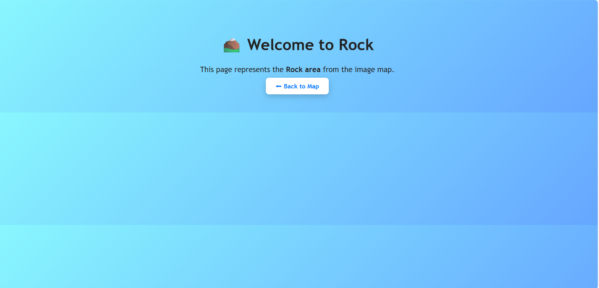
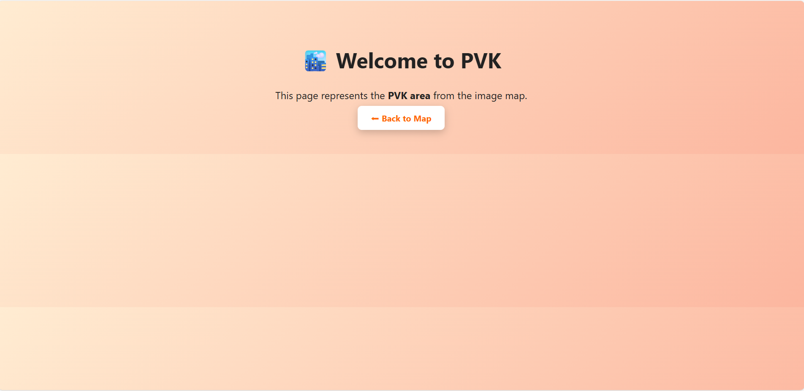
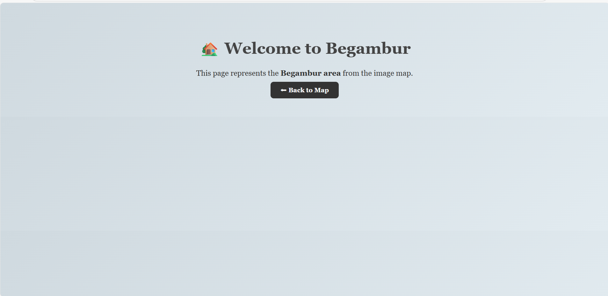
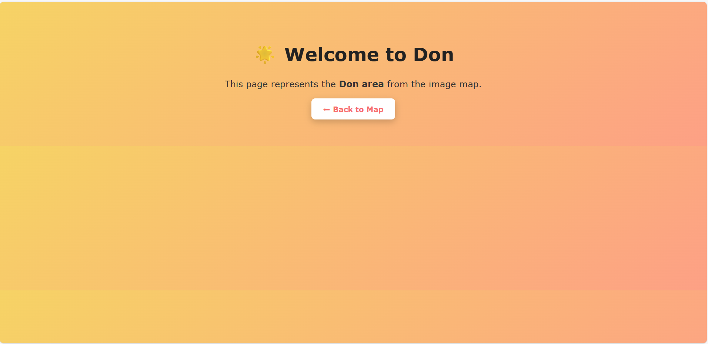

# Ex04 Places Around Me
## Date: 24/09/2025

## AIM
To develop a website to display details about the places around my house.

## DESIGN STEPS

### STEP 1
Create a Django admin interface.

### STEP 2
Download your city map from Google.

### STEP 3
Using ```<map>``` tag name the map.

### STEP 4
Create clickable regions in the image using ```<area>``` tag.

### STEP 5
Write HTML programs for all the regions identified.

### STEP 6
Execute the programs and publish them.

## CODE
~~~
map.html
<!DOCTYPE html>
<html lang="en">
<head>
  <meta charset="UTF-8">
  <title>Image Map Example</title>
</head>
<body>

  <!-- Image Map -->
  

  <map name="image-map">
    <area target="_blank" alt="don" title="don" href="don.html" coords="1479,691,1817,789" shape="rect">
    <area target="_blank" alt="rock" title="rock" href="rock.html" coords="409,437,735,553" shape="rect">
    <area target="_blank" alt="begambur" title="begambur" href="begambur.html" coords="321,709,602,835" shape="rect">
    <area target="_blank" alt="pvk" title="pvk" href="pvk.html" coords="587,34,882,128" shape="rect">
  </map>

</body>
</html>


rock.html
<!DOCTYPE html>
<html lang="en">
<head>
  <meta charset="UTF-8">
  <title>Rock Page</title>
  <style>
    body {
      font-family: 'Trebuchet MS', sans-serif;
      background: linear-gradient(135deg, #89f7fe, #66a6ff);
      text-align: center;
      color: #222;
      padding: 50px;
    }
    h1 {
      font-size: 2.5em;
    }
    p {
      font-size: 1.2em;
      margin-bottom: 20px;
    }
    a {
      padding: 12px 25px;
      background: #fff;
      color: #0077ff;
      border-radius: 8px;
      text-decoration: none;
      font-weight: bold;
      box-shadow: 0 5px 15px rgba(0,0,0,0.2);
      transition: 0.3s;
    }
    a:hover {
      background: #0077ff;
      color: #fff;
    }
  </style>
</head>
<body>
  <h1>⛰️ Welcome to Rock</h1>
  <p>This page represents the <b>Rock area</b> from the image map.</p>
  <a href="index.html">⬅ Back to Map</a>
</body>
</html>


don.html
<!DOCTYPE html>
<html lang="en">
<head>
  <meta charset="UTF-8">
  <title>Don Page</title>
  <style>
    body {
      font-family: Verdana, sans-serif;
      background: linear-gradient(135deg, #f6d365, #fda085);
      text-align: center;
      color: #333;
      padding: 50px;
    }
    h1 {
      font-size: 2.5em;
      color: #222;
    }
    p {
      font-size: 1.2em;
      margin-bottom: 20px;
    }
    a {
      display: inline-block;
      padding: 12px 25px;
      background: #fff;
      color: #f76c6c;
      font-weight: bold;
      border-radius: 8px;
      text-decoration: none;
      box-shadow: 0 5px 15px rgba(0,0,0,0.2);
      transition: 0.3s;
    }
    a:hover {
      background: #f76c6c;
      color: #fff;
    }
  </style>
</head>
<body>
  <h1>🌟 Welcome to Don</h1>
  <p>This page represents the <b>Don area</b> from the image map.</p>
  <a href="index.html">⬅ Back to Map</a>
</body>
</html>


pvk.html
<!DOCTYPE html>
<html lang="en">
<head>
  <meta charset="UTF-8">
  <title>PVK Page</title>
  <style>
    body {
      font-family: 'Segoe UI', sans-serif;
      background: linear-gradient(135deg, #ffecd2, #fcb69f);
      text-align: center;
      color: #222;
      padding: 50px;
    }
    h1 {
      font-size: 2.5em;
    }
    p {
      font-size: 1.2em;
      margin-bottom: 20px;
    }
    a {
      padding: 12px 25px;
      background: #fff;
      color: #ff6600;
      border-radius: 8px;
      text-decoration: none;
      font-weight: bold;
      box-shadow: 0 5px 15px rgba(0,0,0,0.2);
      transition: 0.3s;
    }
    a:hover {
      background: #ff6600;
      color: #fff;
    }
  </style>
</head>
<body>
  <h1>🏙️ Welcome to PVK</h1>
  <p>This page represents the <b>PVK area</b> from the image map.</p>
  <a href="index.html">⬅ Back to Map</a>
</body>
</html>


begambur.html
<!DOCTYPE html>
<html lang="en">
<head>
  <meta charset="UTF-8">
  <title>Begambur Page</title>
  <style>
    body {
      font-family: Georgia, serif;
      background: linear-gradient(135deg, #cfd9df, #e2ebf0);
      text-align: center;
      color: #333;
      padding: 50px;
    }
    h1 {
      font-size: 2.5em;
      color: #444;
    }
    p {
      font-size: 1.2em;
      margin-bottom: 20px;
    }
    a {
      padding: 12px 25px;
      background: #333;
      color: #fff;
      border-radius: 8px;
      text-decoration: none;
      font-weight: bold;
      transition: 0.3s;
    }
    a:hover {
      background: #555;
    }
  </style>
</head>
<body>
  <h1>🏡 Welcome to Begambur</h1>
  <p>This page represents the <b>Begambur area</b> from the image map.</p>
  <a href="index.html">⬅ Back to Map</a>
</body>
</html>


 


~~~


## OUTPUT







## RESULT
The program for implementing image maps using HTML is executed successfully.
